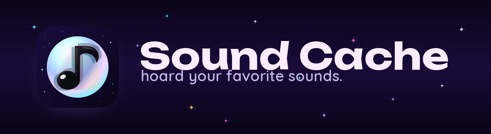
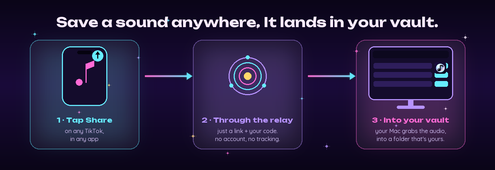
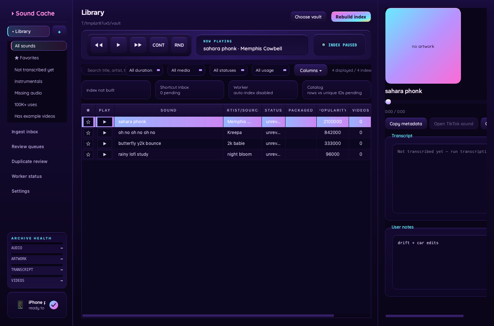

<div align="center">



**Hoard your favorite sounds.** A local-first desktop app that saves TikTok, Instagram, and YouTube sounds into a folder that is *yours*: searchable, tagged, offline, and unbothered.

[soundcache.io](https://soundcache.io) &nbsp;·&nbsp; [Blog](https://soundcache.io/blog/) &nbsp;·&nbsp; [Pair your iPhone](https://soundcache.io/shortcut/)

`local-first` &nbsp;·&nbsp; `no login` &nbsp;·&nbsp; `no cloud` &nbsp;·&nbsp; `GPU transcripts` &nbsp;·&nbsp; macOS today (it is Python, so Windows and Linux are an easy port)

</div>

## Why

TikTok will not let you save the sound. "Favorites" are bookmarks that vanish the moment a video is deleted, a track is taken down, or an account goes private. Screen-recording is lossy, the sketchy mp3 sites are malware, and the link you texted yourself rots in your notes.

Sound Cache fixes that permanently. You save a sound once and it lands as a real, tagged audio file in a local folder you own, complete with the title, artist, artwork, transcript, and example videos, so your FYP's greatest hits outlive platform churn. Built for the **editors and creators** who need the trends offline and organized.

## How it works

You do not change your behavior. You already know how to hit share.

<div align="center">



</div>

1. On TikTok, **tap the sound** (the spinning disc) to open its sound page.
2. Tap **Share ↗**, then **More •••**, then **Save to Sound Cache**.
3. The share sheet hands off the *link* (never your audio) to a tiny relay keyed to your personal pair code.
4. Your desktop pulls the link, downloads the real audio with your own logged-in session, and files it with artwork plus a transcript.

One tap on your phone, and a fully-tagged file appears on your computer. Offline. Unbothered. The relay only ever holds a link on its way to you, with no account, no files, and no tracking. Setup and the signed iOS shortcut live at **[soundcache.io/shortcut](https://soundcache.io/shortcut/)**.

## Features



- **File-native vault.** A `metadata.json` per sound is the source of truth; SQLite is a disposable, rebuildable full-text cache. Everything stays browsable in Finder or on a NAS even if the app never runs.
- **Search by anything.** Title, artist, music ID, tags, spoken phrase (transcript), usage and popularity, status, or local-media state.
- **Rich ingest.** Multi-platform (TikTok, Instagram, YouTube) via yt-dlp with a Playwright capture fallback; pulls artwork, popularity, transcript, and example videos. A shared TikTok video resolves back to its underlying sound so you cache the clean full track, not the trimmed clip.
- **GPU transcripts.** On-device speech-to-text via Whisper, accelerated on your hardware: Apple's MLX runs it on the Apple-Silicon GPU, NVIDIA cards get CUDA automatically, and everything else falls back to a fast CPU path. A background enrichment cycle quietly fills in anything still missing a transcript.
- **Spotify links.** When a sound maps to a commercial track, Sound Cache captures the Spotify link so you can jump straight to the original.
- **Editor-friendly.** Drag a sound out of the window to drop the audio file straight into Premiere, Resolve, or CapCut. Favorites, sorting bins, duplicate review, and archive-health coverage are all built in.
- **Private pairing.** A one-time pair code links your phone's share sheet to your desktop, and the lower-left badge confirms the connection at a glance.
- **Portable by design.** Sound names with kaomoji, emoji, or exotic Unicode are sanitized for any filesystem (byte-accurate length caps, NFC normalization, emoji sequences preserved) so your vault copies cleanly to a NAS or another drive.

## Privacy and security

Local-first means what it says. Your collection lives on your machine, not on a server. There is no account, so there is nothing to leak.

- The **relay** only ever holds a link briefly on its way to your desktop (24-hour TTL), never your files and never a profile of you, and you can stop it in one click.
- Submitted URLs are validated (http and https only; private, reserved, and cloud-metadata hosts rejected) at the relay **and** again at the desktop before any fetch. It is SSRF-hardened, with a safe-redirect handler.
- All request fields are length-bounded, per-pair-code flood caps protect your inbox, and logs redact URLs and never store free-form notes server-side.
- Opt-in leaderboard telemetry is anonymized (a sound id, title, and platform only): no account, no device secret, no paths.

Full [Privacy Policy](https://soundcache.io/privacy/) and [Terms of Use](https://soundcache.io/terms/), including the anti-piracy notice, live on the site.

## Tech

Python 3.12 &nbsp;·&nbsp; PySide6 (Qt6) desktop &nbsp;·&nbsp; FastAPI relay on Vercel with Neon Postgres &nbsp;·&nbsp; SQLite FTS5 &nbsp;·&nbsp; yt-dlp and Playwright for ingest &nbsp;·&nbsp; faster-whisper and MLX for transcription.

## Run it (dev)

```bash
# 1. External tools. TikTok sound capture drives a real browser via Playwright;
#    yt-dlp and ffmpeg handle download and transcode.
brew install node ffmpeg yt-dlp           # macOS (use your package manager elsewhere)
npm install                               # installs Playwright into ./node_modules
npx playwright install chromium           # one-time browser download

# 2. Python app.
python -m venv ~/venvs/sound-cache && source ~/venvs/sound-cache/bin/activate
pip install -e ".[gui,ingest]"            # GUI + on-device transcription + yt-dlp
sound-vault                               # launch the desktop app
# in-app: Settings -> Create pairing code -> Pair iPhone -> Connect TikTok
```

> **You need an active TikTok session.** TikTok serves a sound's audio only to a
> logged-in browser, so the first run walks you through **Connect TikTok**, a
> one-time login the app keeps locally on your machine and never uploads. Without
> Node, Playwright, and Chromium the app still runs, but TikTok sound capture is
> disabled, and the in-app prompts tell you exactly what is missing.

**Apple Silicon note.** The transcription engines ship as native arm64 wheels. Launch the app natively (not under Rosetta) so the GPU path can load; the bundled launcher forces the arm64 slice for you, and the app warns you if it ever finds itself translated.

Tests: `pytest -q` (set `SOUND_VAULT_DISABLE_RELAY_POLL=1 SOUND_VAULT_DISABLE_TRANSCRIBE=1` for a fast offline run).

## License

[MIT](LICENSE). Sound Cache is a tool for personal organization of sounds you are entitled to use; please respect creators' rights and platform terms.

---

<div align="center">
now go forth and hoard ✦ &nbsp;·&nbsp; <a href="https://soundcache.io">soundcache.io</a>
</div>
